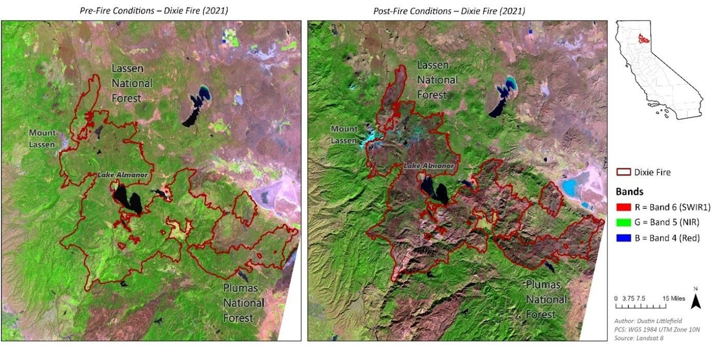
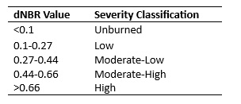
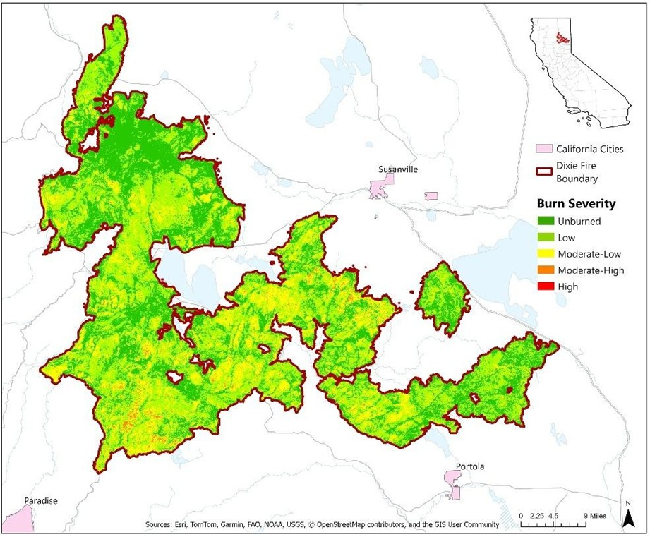
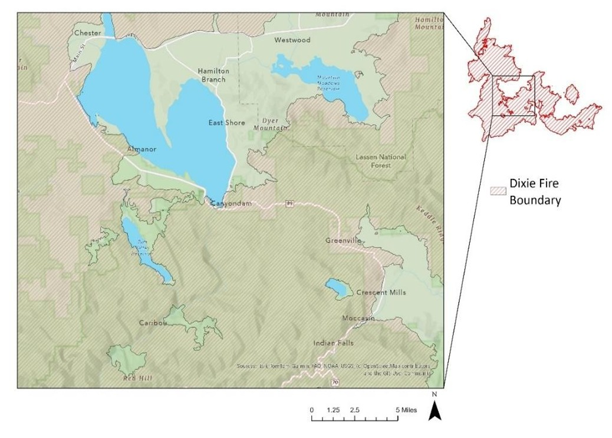
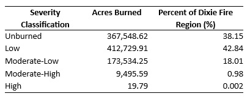

# Assessing Vegetation Loss and Burn Severity in the 2021 Dixie Fire Using Landsat 8

Author: Dustin Littlefield 
Date: February 17, 2026 

## Introduction 
Wildfires, by nature, are chaotic and both difficult to predict or prevent. They are an essential part of the natural ecological life cycle of many forests. However, evidence shows that due to human factors like climate change and increased rural settlement, the rate and severity of fires has been increasing. Financial consequences of this increase stretch far beyond the burned region, as they can impact the economies and ecologies of communities for years. Understanding factors that influence the behavior and severity of wildfires is critical for active firefighting, fire prevention and resource management activities like improving emergency response, refining early warning systems, evaluating fuel management strategies, and guiding future urban planning. 

In 2021, California experienced the largest single source wildfire in its history. The Dixie fire burned almost 1 million acres and destroyed entire communities in its path. Large regions of the Plumas and Lassen National forests were ecologically devastated. It is essential to study the unprecedented scale of the fire and its severity over varied terrains and vegetation types. Information gained from the study can help improve fuel management, guide future preparedness, and add insight into natural vegetation succession. 

Remote sensing has become an essential part of wildfire analysis, both supplementing and guiding on the ground science. Satellite data can provide consistent, frequent, and large-scale information and can capture both pre- and post-fire conditions, making it invaluable for ecological impact analysis.  Indices like the Normalized Burn Ratio (NBR) and the Normalized Difference Vegetation Index (NDVI) can help quantify and locate the most severely burnt areas (Lutes et al., 2006). Imagery can also be obtained for areas that may be unsafe or too costly for land operations. 

The objective of this case study is to use Landsat 8 imagery to analyze the environmental impacts of the Dixie fire.  The study focuses on identifying the extent of the burnt region, assessing the degree of vegetation loss, and quantifying burn severity using remote sensing indices. Finally, spatial analysis is conducted to better understand how factors like terrain, vegetation types, and community density correlate with wildfire severity. 

## Data 

For this case study, individual spectral band data available at 30-meter spatial resolution captured by the Landsat 8’s Operational Land Imager (OLI) sensor was obtained from the USGS earth explorer website. Two dates were identified to correlate with pre- and post- fire conditions. 

The relevant spectral bands used in this Dixie Fire analysis are: 
- Landsat Band 4 – Red (R)  
- Landsat Band 5 – near infrared (NIR) 
- Landsat Band 6 - Shortwave Infrared 1 (SWIR1)  
- Landsat Band 7 - Shortwave Infrared 2 (SWIR2) 

Composite imagery enhances our analysis of imagery because it visualizes spectral information that is normally undetectable by human vision. Bands 6-5-4 are used to generate a false color composite image of the burn site (Figure 1). Placing the near infrared in the green band enhances healthy vegetation because it reflects NIR strongly, so it appears bright green. SWIR1 paced in the red band causes exposed ground and charred areas to appear darker. This composite configuration creates a contrast between vegetation and exposed ground and clearly highlights the extent and thoroughness of the damage caused by the fire.  Supplementary On the Ground information from the US Forest Service's Natural Resource Manager (NRM) Forest Activity Tracking System (FACTS) was also obtained to aid in understanding fire prevention and fuel treatment activities in the burn region (U.S. Forest Service, 2026).  

<figure>
  <figcaption style="font-size:0.9em; margin-bottom:8px;">
    <strong>Figure 1.</strong> False color images (Red, NIR, SWIR1) of Dixie Fire burned area. (Left) Landsat 8 imagery from 07/21/2021. Before the fire the region is consistently green with few interruptions in forested areas. (Right) Landsat 8 imagery from 12/21/2021. Almost complete visible loss of vegetation in the burnt region, including sizeable areas of the Lassen and Plumas National Forests. 
    <em>Map Author: Dustin Littlefield PCS: WGS 1984 UTM 10N 
    Source: Landsat 8 OLI, U.S. Geological Survey (USGS)</em>
  </figcaption>
  
</figure>

## Methodology and Results 
### Normalized Difference Vegetation Index (NDVI)  
The Normalized Difference Vegetation Index (NDVI) is a metric derived from two spectral bands to remotely assess the healthiness of vegetation. Healthy plants absorb red light to produce energy by photosynthesis, while light in the near infrared spectrum is highly reflected due to the nature of leaf structure.  The metric is calculated with the formula:  

<math display="block">
  <mrow>
    <mi>NDVI</mi>
    <mo>=</mo>
    <mfrac>
      <mrow>
        <mi>NIR</mi>
        <mo>−</mo>
        <mi>Red</mi>
      </mrow>
      <mrow>
        <mi>NIR</mi>
        <mo>+</mo>
        <mi>Red</mi>
      </mrow>
    </mfrac>
  </mrow>
</math>
 

For this study, Landsat 8 bands 4 (Red) and band 5 (NIR) are extracted and an NDVI raster is calculated. Values closer to 1 represent actively growing and healthy plants while values approaching 0 are indicative of bare soil and rock. 
Figure 2 depicts NDVI conditions from before and after the 2021 Dixie fire in northern California. Because there is a seasonal change from late summer to early winter in the two images, overall NDVI values naturally decrease due to deciduous vegetation entering dormancy. However, the post-fire image clearly shows a dramatic reduction in NDVI values throughout the burned region. Previously dense forested areas now have values that resemble bare soil in the sparsely vegetated desert region in the east. This dramatic decline in vegetative biomass highlights the widespread ecological destruction done by the fire. 

<figure>
  <figcaption style="font-size:0.9em; margin-bottom:8px;">
    <strong>Figure 2.</strong> NDVI before and after Dixie Fire (2021) Left: Landsat 8 imagery from 07/21/2021 shows healthy vegetation in the burned region with NDVI values that are consistent with surrounding regions.  Right: Landsat 8 imagery from 12/21/2021 shows a dramatic reduction in NDVI through the burned area, indicating a substantial loss of vegetative biomass.  
    <em>Map Author: Dustin Littlefield PCS: WGS 1984 UTM 10N 
    Source: Landsat 8 OLI, U.S. Geological Survey (USGS)</em>
  </figcaption>
  
</figure>

### Normalized Burn Ratio (NBR) and the difference Normalized Burn Ratio (dNBR) 

The Normalized Burn Ratio (NBR) is a spectral index that is used to enhance the visualization of burned areas in remote imagery. It is calculated as: 

<math display="block">
  <mrow>
    <mi>NBR</mi>
    <mo>=</mo>
    <mfrac>
      <mrow>
        <mi>NIR</mi>
        <mo>−</mo>
        <mi>SWIR2</mi>
      </mrow>
      <mrow>
        <mi>NIR</mi>
        <mo>+</mo>
        <mi>SWIR2</mi>
      </mrow>
    </mfrac>
  </mrow>
</math>
 

The index utilizes the near infrared (NIR) and shortwave infrared (SWIR2) to measure the vegetation condition and moisture levels. NIR is highly reflected by healthy vegetation and shortwave infrared is highly sensitive both to the amount of moisture present in vegetation and fire remnants, like ash and char. Every fire is influenced by unique factors, the local terrain, types of vegetation, and the spatial distribution of vegetation. An advantage of using the NBR is that we can get an overview of conditions in the area before extensive research into these factors.  

The difference Normalized Burn Ratio (dNBR) is an additional metric that calculates the change in NBR from two time periods. It is calculated with the formula: 

<math display="block">
  <mrow>
    <mi>dNBR</mi>
    <mo>=</mo>
    <mrow>
      <msub>
        <mi>NBR</mi>
        <mi>prefire</mi>
      </msub>
      <mo>−</mo>
      <msub>
        <mi>NBR</mi>
        <mi>postfire</mi>
      </msub>
    </mrow>
  </mrow>
</math>
 

In this case study, images from before and after the fire are used to generate a numerical dNBR layer. The FIREMON program organized by the US Department of Agriculture (USDA) offers a standard for classifying these raw numeric dNBR values into severity qualifiers (Table 1) that have been correlated with scientific studies conducted on the ground (Lutes et al. 2006).  This classification layer gives a quick overview of burn severity that can be used to guide further insights for analysis and field activities. Figure 3 depicts the burn severity classifications for the entirety of the Dixie Fire affected region. 

<figure>
  <figcaption style="font-size:0.9em; margin-bottom:8px;">
    <strong>Table 1.</strong> FIREMON classification schema for qualifying burn severity from dNBR
  </figcaption>
  
</figure>

<figure>
  <figcaption style="font-size:0.9em; margin-bottom:8px;">
    <strong>Figure 3.</strong> Burn severity classification of the 2021 Dixie Fire using the difference Normalized Burn Ratio. Results indicate low to moderate severity throughout most of the region with clusters of moderate high severity concentrated in a few regions.   
    <em>Map Author: Dustin Littlefield PCS: WGS 1984 UTM 10N 
    Source: Landsat 8 OLI, U.S. Geological Survey (USGS)</em>
  </figcaption>
  
</figure>

## Spatial Burn Pattern Analysis 
At the center of the burn is Lake Almanor, around which several communities got hit the hardest. Three small towns, Canyondam, Greenville, and Indian Falls, all on highway 89 south of the lake were destroyed entirely (Figure 4). Chester, a small-town northwest of the lake, was surrounded by fire but thanks to a strong firefighter defense survived the devastation.  

<figure>
  <figcaption style="font-size:0.9em; margin-bottom:8px;">
    <strong>Figure 4.</strong> Overlay of burned region highlighting communities around Lake Almanor affected by the Dixie Fire. Several communities along highway 89 were destroyed by the fire including Canyondam, Greenville and Indian Falls.  
    <em>Map Author: Dustin Littlefield PCS: WGS 1984 UTM 10N 
    Source: Landsat 8 OLI, U.S. Geological Survey (USGS)</em>
  </figcaption>
  
</figure>

The dNBR burn severity classification allows more detailed spatial analysis of the fire. The most severely burned areas are clustered in the southern region of the burn in the Plumas National Forest. Some factors contributing to higher severity in the region include the presence of many southern facing slopes, which intensify the spread of wildfires, and more densely packed vegetative growth (Estes, Collins, Stephens, & North, 2017). The remoteness of this region makes conducting fire prevention efforts like strategic thinning and controlled burns more difficult and expensive (Figure 5).  

<figure>
  <figcaption style="font-size:0.9em; margin-bottom:8px;">
    <strong>Figure 5.</strong> Burn severity map for southern area of burn in Plumas National Forest. Little to no fuel treatment activities were conducted before the fire. The steep southern slopes of the area make up the largest clusters of higher severity burns.  
    <em>Map Author: Dustin Littlefield PCS: WGS 1984 UTM 10N 
    Source: Landsat 8 OLI, U.S. Geological Survey (USGS)</em>
  </figcaption>
  
</figure>

North of Lake Almanor is the Lassen National Forest. In contrast to the Plumas Forest, this area has more space between vegetation and less difficult steeper slopes.  This overall flatter terrain creates slower burns and allows easier access for fire prevention efforts, potentially causing less burn severity overall (Figure 6). 

<figure>
  <figcaption style="font-size:0.9em; margin-bottom:8px;">
    <strong>Figure 6.</strong> Burn severity map for region of the Lassen National Forest burnt by Dixie Fire. Overlay includes fire prevention efforts in the region. There is more thinning and controlled burn activity than in the Plumas Forest.   
    <em>Map Author: Dustin Littlefield PCS: WGS 1984 UTM 10N 
    Source: Landsat 8 OLI, U.S. Geological Survey (USGS)</em>
  </figcaption>
  
</figure>

## Results 
The Dixie Fire area is composed of a total of 963,328.17 acres, of which 595,779.55 acres were burned to some degree in the region. Although the fire was expansive, most of the region saw moderate to low severity with 412,729 acres (42.84%) classified as low severity and 173,534.25 (18.01%) classified as moderate-low severity. These lower severity areas may experience ecological recovery faster.  
 
<figure>
  <figcaption style="font-size:0.9em; margin-bottom:8px;">
    <strong>Table 1.</strong> A breakdown of the burn severity classification levels for the 2021 Dixie Fire by acreage and percent of total area burned
  </figcaption>
  
</figure>
 
Further analysis may aid in future fire mitigation efforts including more in-depth fuel treatment analysis. These can help identify where strategies succeeded or not and where there may be chokepoints in the terrain to concentrate future thinning strategies. A thorough review of the spread and severity along the region’s roads can help evaluate access and effectiveness of evacuation routes and strategies. Since successful fire defense efforts were conducted in Chester, a zoomed in analysis of the fire behaviors around the town may identify efforts that can be adopted in smaller communities.  Ecological progress can also be monitored with a time-series analysis to track vegetation recovery and evaluate the long-term impacts from the fire. 

## Conclusion 
I live nestled into the foothills of the cascades where wildfires are a genuine concern for safety, property damage, and air pollution.  Because of this, wildfire science is of particular interest to me, and I was excited for my first hands on experience working with the Normalized Burn Ratio to visualize and analyze fires impact. In my future spatial analyst career, I plan to incorporate wildfire analysis techniques to aid with strategic thinning strategies, regrowth planning and monitoring and improving fire defense strategies. The most challenging part of this case was constructing a clear and concise narrative for the analysis by maintaining visual consistency and subject integration throughout the maps. 

## References 
U.S. Forest Service. (2026). Hazardous Fuel Treatment Reduction – Polygon (Feature Layer) [Geospatial dataset]. ArcGIS Hub. U.S. Department of Agriculture. CC BY 4.0. Retrieved [date you accessed it], from https://data-usfs.hub.arcgis.com/datasets/usfs::hazardousfuel-treatment-reduction-polygon-feature-layer 

Lutes, D. C., Keane, R. E., Caratti, J. F., Key, C. H., Benson, N. C., Sutherland, S., & Gangi, L. 
J. (2006). FIREMON: Fire effects monitoring and inventory system (Gen. Tech. Rep. RMRS-
GTR-164). U.S. Department of Agriculture, Forest Service, Rocky Mountain Research Station. https://doi.org/10.2737/RMRS-GTR-164 

Estes, B. L., Collins, B. M., Stephens, S. L., & North, M. P. (2017). Factors influencing fire severity under moderate burning conditions. Ecosphere, 8(12), e01994. https://doi.org/10.1002/ecs2.1794 

