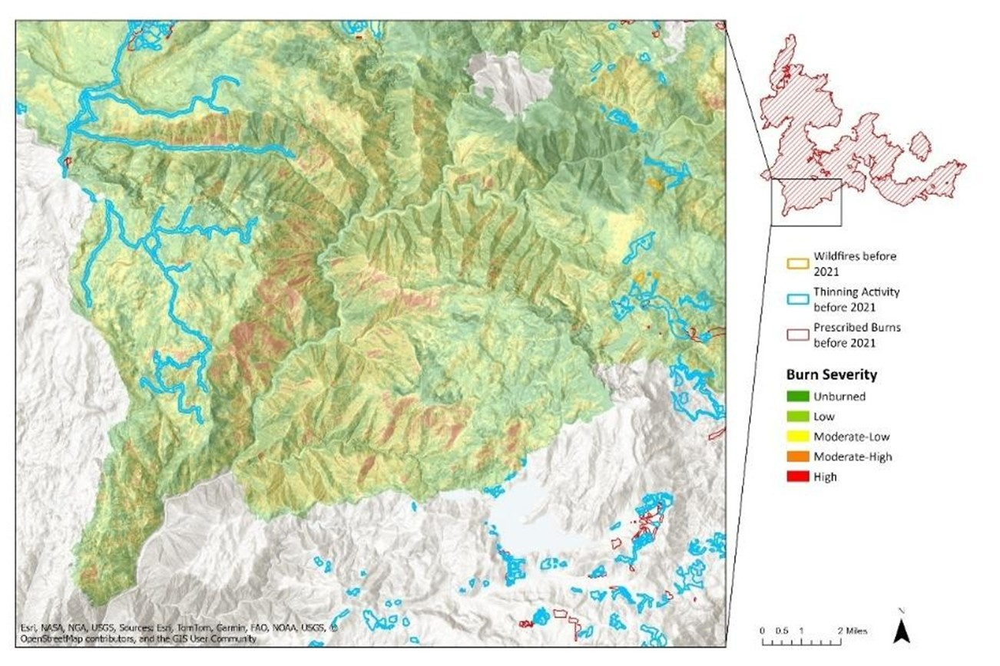

# Assessing Vegetation Loss and Burn Severity in the 2021 Dixie Fire Using Landsat 8

**Author:** Dustin Littlefield  
**Portfolio:** https://github.com/dustinlit  
**Project Type:** `Remote Sensing` `Wildfire Ecology` `Burn Severity Analysis`  
**Technologies:** `ArcGIS Pro` `Sentinel-2` `Landsat 8` `NDVI` `NBR` `dNBR`  
**Last Updated:** March 2026

---
## Overview
This project utlizes Landsat 8 imagery obtained from the USGS Earth Explorer website. The goal is to classify burn severity among the fires nearly 1 million acres burned.

  

## Methodology

**Data Source**:  Landsat 8’s Operational Land Imager (OLI) sensor obtained from the USGS earth explorer website

**Dates Analyzed**:  
*pre-fire*: July 21, 2021  
*post-fire*: December 21, 2021

**Indices:**
- NBR (Normalized Burn Ratio): Used to identify burned areas.
- dNBR (delta Normalized Burn Ratio): Used to classify burn severity according to USGS standards.
- NDVI (Normalized Difference Vegetation Index): Used to assess pre-fire vegetation health and post-fire mortality.

## Analysis

**Burn Severity Mapping**
  - Identify hot-spots of highest burn severity
  - Analyze severity surrounding impacted communities
  - Analyze effectivenedd of fire prevention efforts (thinning, prescribed fires)

## Results
The analysis revealed a clear divide in fire behavior based on human intervention and physical geography:

**Social Impact:** 
- The most devastating human impacts were concentrated in the communities surrounding Lake Almanor, where high-intensity fire runs met the wildland-urban interface.

**Lassen National Forest:** 
- Lower overall severity
- More accessible terrain
- Specific forest compositions that resisted crown fires
- The measurable success of fire prevention efforts (thinning and prescribed burns)

**Plumas National Forest:** 
- Highest burn severity and largest continuous "high-intensity" footprints
- Steeper slopes with more inaccessible terrain for firefighters
- Less fire prevention measures